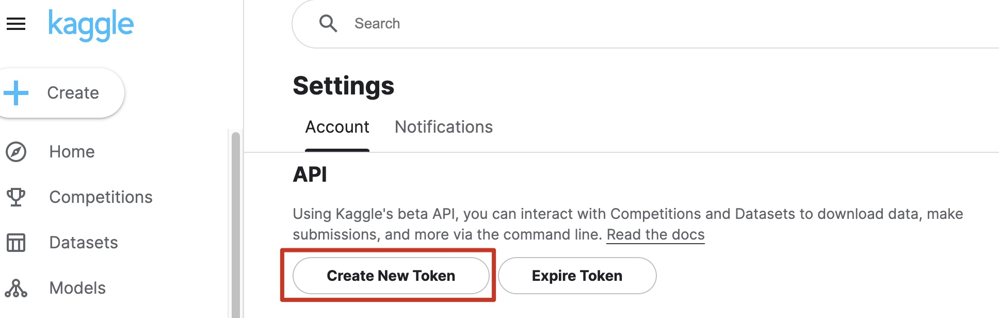

# Sephore Skincare Products Recommender System

- Author: Amelia Tang 

## About 
TBU

## Reports 
TBH 

## Visualizations 
TBU 

## Usage

### Creating the environment

At the project root
`conda env create --file sephore_env.yaml`

 Run the following command from the environment where you installed
JupyterLab.

`conda install nb_conda_kernels`

### Downloading the dataset from Kaggle via the Command line / Terminal 
Step 1: Install kaggle `pip install kaggle` (See Note 1)
 Step 2: Create the directory to store Kaggle API token `mkdir ~/.kaggle` 
 Step 3: Create the token under Account 'Settings' on Kaggle website and it will start to download a JSON file. I downloaded the file to the 'Downloads' folder. 
 
 Step 4: Copy the JSON file to the directory for storing Kaggle API token created in Step 2
`cp /Users/YOUR-USER-NAME/Downloads/kaggle.json /Users/YOUR-USER-NAME/.kaggle/kaggle.json` (See Note 2)
 Step 5: `cd` into the directory where you'd like to save the data 
 Step 6: Search for the dataset you need for the project `kaggle datasets list -s 'Sephora Products and Skincare Reviews'`
 Step 7: Download the dataset `kaggle datasets download -d 'nadyinky/sephora-products-and-skincare-reviews'`
 Step 8 (optional): You can run `chmod 600` + directory where you store your Kaggle API token if it's a share computer / machine to protect your API token.   
Step 9: Unzip the downloaded data file `unzip` + file name (See Note 3)

Notes: 
 1. This is already included in the `sephora_env` so you don't need to install kaggle if you are using the `sephora_env` created for this project.
 2. The first directory after `cp` should be the one where you downloaded the JSON file. 
 3. If you are using the `sephora_env` you don't need to install unzip, but if the environment you use don't have this package, you need to run `pip install unzip`. 

## Dependencies

TBU - A complete list of dependencies is available [here](TBU).
 Python 3.10.12 and Python packages: 
 - hdbscan==0.8.29
 - openai==0.27.8
 - umap==0.1.1
 - nltk=3.7=pyhd3eb1b0_0
 - textblob=0.15.3=py_0

## References 
TBU

